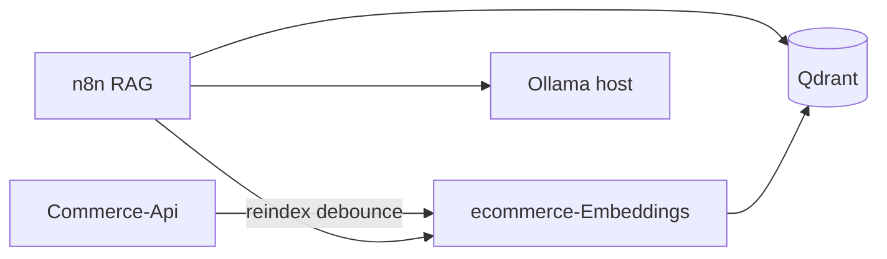

# ecommerce-Embeddings

Microservice **Python (FastAPI)** cho **embedding sản phẩm**, **index Qdrant** và API **`POST /v1/embed`** dùng chung cho RAG (client: n8n workflow). Hỗ trợ:

- **Backend embedding `local`**: [sentence-transformers](https://www.sentence-transformers.org/) (mặc định, chạy offline, phù hợp dev local không API key).
- **Backend `protonx`**: [ProtonX Embeddings API](https://protonx.co/embeddings_models.html) qua package `protonx` + `PROTONX_API_KEY`.

Commerce-Api gọi dịch vụ này khi cần reindex vector (debounce); luồng chat đi qua **n8n** → embed → Qdrant → Ollama.

## Vị trí trong hệ sinh thái



## Stack cục bộ (bước 0)

1. **Ollama** (Windows / macOS): cài từ [ollama.com](https://ollama.com), sau đó:

   ```bash
   ollama pull qwen2.5:7b
   ollama serve
   ```

2. **Docker**: Qdrant + n8n:

   ```bash
   docker compose -f docker-compose.rag.yml up -d
   ```

   - Qdrant: `http://localhost:6333`
   - n8n: `http://localhost:5678`

3. Copy `.env.example` → `.env` trong thư mục này và chỉnh `DATABASE_URL` trùng Commerce-Api.

4. Cài Python 3.11+ (khuyến nghị) và:

   ```bash
   pip install -r requirements.txt
   uvicorn app.main:app --host 0.0.0.0 --port 8030 --reload
   ```

5. Khởi tạo collection Qdrant (sau khi service chạy một lần để tạo model):

   ```bash
   python scripts/init_qdrant_collection.py
   ```

6. Index sản phẩm:

   ```bash
   curl -X POST http://localhost:8030/v1/index/reindex -H "Content-Type: application/json" -H "X-Reindex-Key: YOUR_SECRET_IF_SET" -d "{}"
   ```

## Biến môi trường (rút gọn)

| Biến | Mô tả |
|------|--------|
| `EMBEDDING_BACKEND` | `local` \| `protonx` |
| `PROTONX_API_KEY` | Bắt buộc nếu `protonx` |
| `QDRANT_URL` | VD `http://localhost:6333` |
| `QDRANT_COLLECTION` | VD `products_v1` |
| `DATABASE_URL` | PostgreSQL (cùng schema Commerce-Api) |
| `EMBEDDINGS_REINDEX_SECRET` | Khớp header `X-Reindex-Key` |
| `STORE_PUBLIC_URL` | URL storefront để ghép link sản phẩm trong payload |

Chi tiết: `.env.example`.

## Tài liệu thêm

- [docs/CONTRACT.md](docs/CONTRACT.md) — contract JSON với Commerce-Api / n8n
