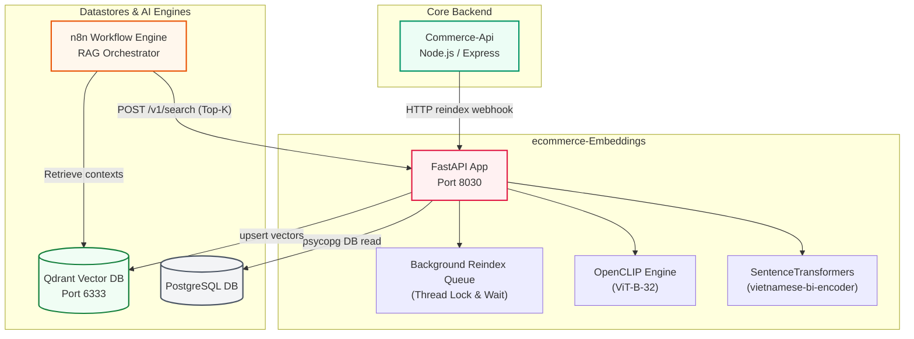

<p align="center">
  
</p>

# NextCommerce — Embeddings & Vector Search Service (test git action)

> FastAPI-based microservice responsible for generating text & visual embeddings, managing Qdrant vector collections, and serving semantic search endpoints for the platform's RAG chatbot (n8n workflow) and image search pipelines.

[](https://www.python.org/)
[](https://fastapi.tiangolo.com/)
[](https://qdrant.tech/)
[](https://pytorch.org/)

---

## 📋 Table of Contents
- [Overview](#-overview)
- [Ecosystem Placement](#-ecosystem-placement)
- [Tech Stack](#-tech-stack)
- [AI Models & Embeddings](#-ai-models--embeddings)
- [Project Structure](#-project-structure)
- [Prerequisites](#-prerequisites)
- [Installation](#-installation)
- [Environment Variables](#-environment-variables)
- [Database & Qdrant Setup](#-database--qdrant-setup)
- [Running the App](#-running-the-app)
- [API Documentation](#-api-documentation)
- [Reindexing Queue Architecture](#-reindexing-queue-architecture)
- [Testing](#-testing)
- [Deployment](#-deployment)

---

## 🎯 Overview
**ecommerce-Embeddings** is the semantic indexing powerhouse of the NextCommerce platform. It abstracts raw machine learning inference away from the core transactional Node.js backend. 

### Key Capabilities
- **Semantic Text Search**: Segments Vietnamese text and maps catalog data into dense vector spaces.
- **Multimodal Visual Search**: Encodes product gallery images via CLIP to enable reverse-image product lookups.
- **RAG Chatbot Middleware**: Exposes lightweight search endpoints that n8n orchestrates with LLMs to answer client questions with high-fidelity context.
- **Transactional Synchronization**: Listens to catalog updates from the Commerce API to dynamically update vectors in the background.

---

## 🌐 Ecosystem Placement



---

## 🛠️ Tech Stack

| Category | Technology | Version | Description |
|----------|------------|---------|-------------|
| **Framework** | FastAPI | `0.115.12` | High-performance Python web framework |
| **Server** | Uvicorn | `0.34.0` | ASGI server implementation |
| **Text Embedding** | SentenceTransformers | `3.3.1` | Text similarity model framework |
| **NLP (Vietnamese)**| Underthesea | `>= 6.8.4` | Vietnamese word segmentation tokenizer |
| **Visual Embedding**| OpenCLIP | `>= 2.26.1` | Multi-modal CLIP transformer provider |
| **Deep Learning** | PyTorch | `2.3.0` (CPU/CUDA) | Tensor computation and inference engine |
| **Vector Database** | Qdrant Client | `1.12.1` | Vector database API client |
| **Database Driver** | Psycopg 3 | `3.2.6` | PostgreSQL DB adapter |
| **HTTP Client** | HTTPX | `0.28.1` | Async HTTP requests for image downloads |
| **Telemetry** | Prometheus Client | `>= 0.17` | Exposes performance metrics at `/metrics` |

---

## 🤖 AI Models & Embeddings

### 📝 1. Text Embedding Model
- **Model**: `bkai-foundation-models/vietnamese-bi-encoder`
- **Source**: Hugging Face (BKAI Foundation)
- **Dimension**: `768`
- **Description**: Explicitly trained to encode Vietnamese sentences.
- **Preprocessing**: Prior to inference, text is parsed using `underthesea.word_tokenize(format="text")` to replace spaces between compound words with underscores (e.g., `điện thoại` $\rightarrow$ `điện_thoại`), significantly improving embeddings quality.

### 🖼️ 2. Visual Embedding Model
- **Model Architecture**: `ViT-B-32`
- **Pretrained Weights**: `laion2b_s34b_b79k` (OpenCLIP)
- **Dimension**: `512`
- **Description**: Multi-modal vision-language model trained on LAION-2B. Map image pixels and text queries to the same unified vector space.

---

## 📁 Project Structure

```
ecommerce-Embeddings/
├── app/
│   ├── main.py              # Application entry point & REST routers
│   ├── config.py            # Settings validation (Pydantic BaseSettings)
│   ├── db.py                # SQL database queries using Psycopg
│   ├── chunking.py          # Formats metadata and splits description text
│   ├── embedding_provider.py# Loads sentence-transformers and segments text
│   ├── clip_provider.py     # Lazy-loads OpenCLIP and encodes images
│   ├── qdrant_store.py      # Qdrant client connection & collection CRUD helper
│   └── logging_config.py    # Standardized json logger settings
├── scripts/
│   └── init_qdrant_collection.py # Initializer tool to set up vectors payload indices
├── tests/
│   └── test_embeddings.py   # Vitest / Pytest integration scripts
├── requirements.txt         # Production dependencies
├── requirements.dev.txt     # Local developer test suites packages
├── Dockerfile
└── docker-compose.rag.yml   # Spins up Qdrant and n8n in container networks
```

---

## ✅ Prerequisites

- Python `>= 3.11`
- PostgreSQL database
- Qdrant Vector Database instance (Running locally or on Qdrant Cloud)
- CUDA-enabled GPU (Optional; CPU execution is default with auto-fallback)

---

## 🚀 Installation

1. **Activate Virtual Environment:**
   ```bash
   # Create environment
   python -m venv .venv
   
   # Activate (Windows PowerShell)
   .\.venv\Scripts\Activate.ps1
   
   # Activate (macOS/Linux)
   source .venv/bin/activate
   ```

2. **Install dependencies:**
   ```bash
   pip install --upgrade pip
   pip install -r requirements.txt
   ```

3. **Configure Environment:**
   ```bash
   cp .env.example .env
   ```

---

## 🔐 Environment Variables

Key parameters inside `.env`:

| Key | Default | Description |
|-----|---------|-------------|
| `APP_ENV` | `local` | Stage mode (`local` / `dev` / `production`) |
| `API_HOST` | `0.0.0.0` | Port listening host interface |
| `API_PORT` | `8030` | Port running the FastAPI app |
| `DATABASE_URL` | *Required* | PostgreSQL URL to pull product details |
| `EMBEDDING_DEVICE` | `auto` | Run inference on `cuda` if available, else `cpu` |
| `EMBEDDING_LOCAL_MODEL`| `bkai-foundation-models/vietnamese-bi-encoder` | SentenceTransformer model path |
| `QDRANT_URL` | `http://localhost:6333` | Qdrant host address |
| `QDRANT_COLLECTION` | `products_v1` | Collection name for text embeddings (768-dim) |
| `QDRANT_IMAGE_COLLECTION`| `products_images_v1` | Collection name for CLIP visual embeddings (512-dim)|
| `CLIP_ENABLED` | `true` | Set to `false` to disable image indexing |
| `EMBEDDINGS_REINDEX_SECRET`| "" | Token verification header `X-Reindex-Key` |
| `STORE_PUBLIC_URL` | `http://localhost:3000` | Base URL used to build direct item links |
| `CHUNK_MAX_CHARS` | `600` | Maximum character length of text chunks |
| `CHUNK_OVERLAP` | `80` | Overlap character length between chunks |
| `EMBEDDING_BATCH_SIZE` | `32` | Batch size processing text segments |

---

## 🗄️ Database & Qdrant Setup

1. **Bootstrap Qdrant & n8n Containers:**
   Ensure Docker is active, then run:
   ```bash
   docker compose -f docker-compose.rag.yml up -d
   ```

2. **Create Qdrant Collections & Payloads:**
   This script reads your configurations, fetches model structures, and constructs collections with correct distances (Cosine metric) and payload index fields (indexes on `product_id` for fast deletion/filtering):
   ```bash
   python scripts/init_qdrant_collection.py
   ```

3. **Execute Initial Catalog Bulk Reindex:**
   Trigger the reindex endpoint manually to populate Qdrant:
   ```bash
   curl -X POST http://localhost:8030/v1/index/reindex \
     -H "Content-Type: application/json" \
     -H "X-Reindex-Key: YOUR_SECRET_KEY" \
     -d "{}"
   ```

---

## ▶️ Running the App

```bash
# Run in development mode (hot-reload)
uvicorn app.main:app --host 0.0.0.0 --port 8030 --reload

# Run in production mode
uvicorn app.main:app --host 0.0.0.0 --port 8030 --workers 4
```

- **Interactive API Docs (Swagger)**: Access `http://localhost:8030/docs`
- **ReDoc Viewer**: Access `http://localhost:8030/redoc`
- **Prometheus Telemetry**: Access `http://localhost:8030/metrics`

---

## 📡 API Documentation

### 🔍 Search & Embedding
#### 1. POST `/v1/embed`
Generates raw vector representation of texts.
- **Request Body**:
  ```json
  {
    "text": "Laptop Gaming ASUS ROG",
    "inputs": [] // Optional batch list of strings
  }
  ```
- **Response**: Returns a JSON object containing the model name, vector dimensions (`768`), and raw float embeddings.

#### 2. POST `/v1/search`
Encodes a query and searches the Qdrant text collection. Useful for chatbot context lookup.
- **Request Body**:
  ```json
  {
    "text": "sách kinh tế hay",
    "limit": 5,
    "score_threshold": 0.4,
    "product_id": null // Optional target filter ID
  }
  ```
- **Response**: Returns Top-K hits grouped by product ID, containing similarity score, payload details, and text chunks.

#### 3. POST `/v1/search-by-image` (CLIP Visual Search)
Accepts an image file or URL, encodes it via CLIP, and retrieves visually similar products.
- **Form-Data**:
  - `file`: *UploadFile (Optional)*
  - `image_url`: *String (Optional)*
  - `limit`: `8`
  - `score_threshold`: `0.3`
- **Response**: Returns matching visual targets from the Qdrant image collection.

---

### ⚙️ Catalog Synchronization Webhook
#### POST `/v1/index/reindex`
Triggers background indexing of PostgreSQL catalog data into Qdrant.
- **Request Headers**: `X-Reindex-Key` (Must match configured secret)
- **Request Body**:
  ```json
  {
    "product_id": null, // If specified, only reindexes this product.
    "full_reset": false // If true, deletes and recreates collections first.
  }
  ```
- **Response Status**: `202 Accepted` (Processes the job asynchronously in a background thread).

---

## 🧵 Reindexing Queue Architecture

To prevent system resource exhaustion, `app/main.py` uses a thread-safe, locked background queue:
- **Concurrency Gating**: Uses a Python `threading.Lock` and `threading.Thread` to ensure only **one** indexing job executes at a time.
- **State Tracking**: Stores current job IDs, execution time, failures, and statistics in memory. Accessible via `GET /health`.
- **Double Queueing Prevention**: If a reindex job is active and a new request arrives, it is queued. If another request arrives while one is already in the queue, it is rejected or merges with the queue to prevent unnecessary duplicate runs.

---

## 🧪 Testing

```bash
# Run pytest suites
pytest
```

---

## 🐳 Deployment

### Docker Build
```bash
docker build -t ecommerce-embeddings .
docker run -d -p 8030:8030 --env-file .env ecommerce-embeddings
```
*Note: HuggingFace hub caches are configured to write to `/tmp` in the container to remain compliant with read-only environments.*
