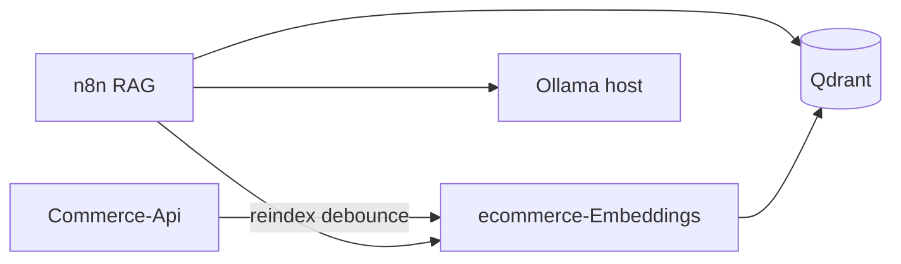

# ecommerce-Embeddings

Microservice **Python (FastAPI)** cho **embedding sản phẩm**, **index Qdrant** và API **`POST /v1/embed`** dùng chung cho RAG (client: n8n workflow). Hỗ trợ:

- **Backend embedding `local`**: [sentence-transformers](https://www.sentence-transformers.org/) (chạy offline, phù hợp local và production không API key).

Commerce-Api gọi dịch vụ này khi cần reindex vector (debounce); luồng chat đi qua **n8n** → embed → Qdrant → Ollama.

## Cấu hình backend theo môi trường

- Local/dev/production: dùng Sentence Transformers (`EMBEDDING_BACKEND=local`).
- `EMBEDDING_DEVICE=auto` sẽ tự chọn CUDA nếu có, fallback CPU.
- Có thể kiểm tra backend hiệu lực bằng `GET /health` (trả về `app_env` và `embedding_backend`).

## Vị trí trong hệ sinh thái



## Stack cục bộ (bước 0)

1. **Ollama** (Windows / macOS): cài từ [ollama.com](https://ollama.com), sau đó:

   ```bash
   ollama pull qwen2.5:7b
   ollama serve
   ```

2. **Docker**: Qdrant + n8n:

   ```bash
   docker compose -f docker-compose.rag.yml up -d
   ```

   - Qdrant: `http://localhost:6333`
   - n8n: `http://localhost:5678`

3. Copy `.env.example` → `.env` trong thư mục này và chỉnh `DATABASE_URL` trùng Commerce-Api.

4. **Python venv** (khuyến nghị, Python 3.11+). Từ thư mục `ecommerce-Embeddings`:

   **Windows (PowerShell)**

   ```powershell
   py -3.11 -m venv .venv
   .\.venv\Scripts\Activate.ps1
   python -m pip install --upgrade pip
   pip install -r requirements.txt
   ```

   **macOS / Linux**

   ```bash
   python3.11 -m venv .venv
   source .venv/bin/activate
   pip install --upgrade pip
   pip install -r requirements.txt
   ```

   Mỗi phiên làm việc mới: kích hoạt lại `.venv` rồi chạy lệnh bên dưới.

5. Chạy API:

   ```bash
   uvicorn app.main:app --host 0.0.0.0 --port 8030 --reload
   ```

6. Khởi tạo collection Qdrant (venv đã kích hoạt; sau khi model embedding tải xong lần đầu):

   ```bash
   python scripts/init_qdrant_collection.py
   ```

7. Index sản phẩm:

   ```bash
   curl -X POST http://localhost:8030/v1/index/reindex -H "Content-Type: application/json" -H "X-Reindex-Key: YOUR_SECRET_IF_SET" -d "{}"
   ```

## Biến môi trường (rút gọn)

| Biến | Mô tả |
|------|--------|
| `APP_ENV` | `local` \| `dev` \| `production` |
| `EMBEDDING_BACKEND` | Chỉ dùng `local` (Sentence Transformers) |
| `EMBEDDING_DEVICE` | `auto` \| `cpu` \| `cuda` |
| `QDRANT_URL` | VD `http://localhost:6333` |
| `QDRANT_COLLECTION` | VD `products_v1` |
| `DATABASE_URL` | PostgreSQL (cùng schema Commerce-Api) |
| `EMBEDDINGS_REINDEX_SECRET` | Khớp header `X-Reindex-Key` |
| `STORE_PUBLIC_URL` | URL storefront để ghép link sản phẩm trong payload |

Chi tiết: `.env.example`.

## Tài liệu thêm

- [docs/CONTRACT.md](docs/CONTRACT.md) — contract JSON với Commerce-Api / n8n
